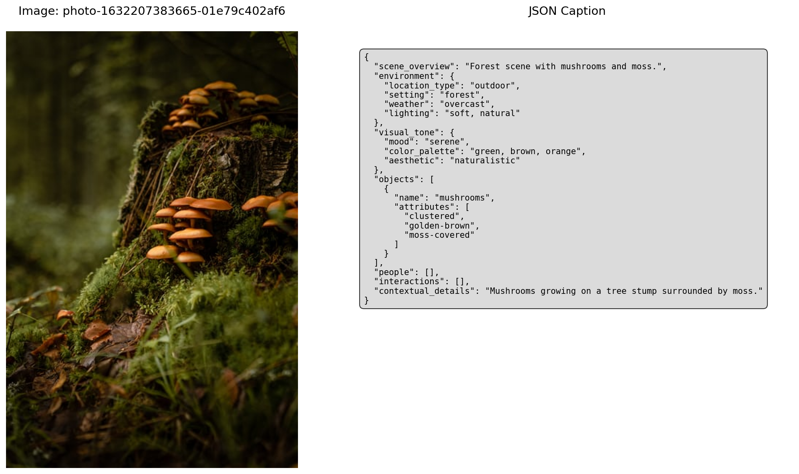
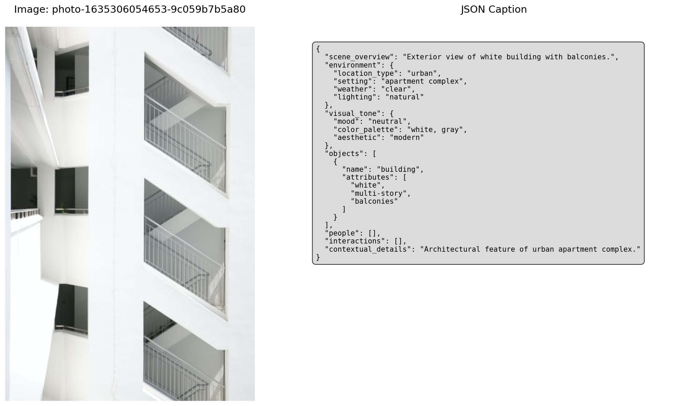

# Image Captioning with Qwen2.5-VL

A Python application that generates structured captions for images using the Qwen2.5-VL vision-language model through Ollama. The system produces detailed JSON-formatted descriptions including scene analysis, visual tone, objects, and people detection.

## Features

- **Automated Image Captioning**: Generate detailed captions for images using the Qwen2.5-VL model
- **Structured Output**: JSON-formatted captions with organized sections for better data processing
- **Batch Processing**: Process multiple images in a directory automatically
- **Demo Generation**: Create visual demonstrations of the captioning results
- **Kaggle Integration**: Automatically download sample images if none are provided
- **Configurable Prompts**: Customizable prompting system through YAML configuration

## Output Format

The system generates structured JSON captions with the following sections:

- **Scene Overview**: One-sentence summary of the image
- **Environment**: Location type, setting, weather, and lighting conditions
- **Visual Tone**: Mood, color palette, and aesthetic style
- **Objects**: Detected objects with their attributes
- **People**: Person detection with clothing, expressions, and activities

## Demo Output

Here's an example of what the system produces - image on the left with the complete JSON caption on the right:




*The demo shows a forest scene with mushrooms, displaying the structured JSON output with detailed scene analysis, environmental conditions, visual tone, and object detection.*

## Prerequisites

- Python 3.12
- [Ollama](https://ollama.com/) installed and running
- Qwen2.5-VL model pulled in Ollama (`ollama pull qwen2.5vl:7b`)

## Installation

1. Clone the repository:

```bash
git clone https://www.github.com/suhanpark/captioning-with-qwen
cd captioning-with-qwen
```

2. Run setup file:

```bash
bash ./setup.sh
```

## Usage

### Basic Usage

1. Place your images in the `data/source/` directory
2. Run the application:

```bash
python main.py
```

The system will:

- Process all images in the `data/source/` directory
- Generate captions and save them to `data/captions/`
- Create a demo visualization in the `data/demo/` directory

### Enhanced Features

**Parallel Processing (4-5x faster):**

```bash
python main.py --parallel --workers 6
```

**Generate Multiple Demos:**

```bash
python main.py --num-demos 3
```

**Use Caching (skip already processed images):**

```bash
python main.py --use-cache --parallel
```

**Process Specific Amount:**

```bash
python main.py --process-amount 10 --parallel
```

### Configuration

#### Prompt Customization

Edit `prompt.yaml` to modify the captioning prompt and output format. The current configuration generates structured JSON with detailed scene analysis.

### Project Structure

```text
captioning-with-qwen/
├── main.py              # Main application entry point
├── prompt.yaml          # Prompt configuration
├── requirements.txt     # Python dependencies
├── setup.sh            # Setup script
├── demo.png            # Example demo output
├── core/               # Core application modules
│   ├── __init__.py     # Package initialization
│   ├── config.py       # Configuration management
│   ├── ollama_service.py # Ollama integration service
│   ├── utils.py        # Utility functions
│   └── cache_manager.py # Caching system
├── data/
│   ├── source/         # Input images directory
│   ├── captions/       # Generated captions
│   ├── demo/           # Demo visualizations
│   └── cache/          # Cache storage
└── README.md           # This file
```

## Reference

### Core Functions

#### `get_caption(img_path: str) -> str`

Generate a caption for a single image.

#### `map_captions(image_files: list[str], root: str) -> dict[str, str]`

Process multiple images and return a dictionary of captions.

#### `make_demo(data_dir: str)`

Create a visual demonstration of the captioning results.

## Sample Output

```json
{
  "scene_overview": "A person walking through a bustling city street",
  "environment": {
    "location_type": "urban",
    "setting": "city street with buildings",
    "weather": "clear",
    "lighting": "natural daylight"
  },
  "visual_tone": {
    "mood": "energetic",
    "color_palette": "warm tones with blues",
    "aesthetic": "street photography"
  },
  "objects": [
    {"name": "building", "attributes": ["tall", "modern"]},
    {"name": "street", "attributes": ["paved", "busy"]}
  ],
  "people": [
    {
      "role": "adult",
      "clothing": "casual jacket and jeans",
      "expression": "neutral",
      "activity": "walking"
    }
  ]
}
```

## Troubleshooting

### Common Issues

1. **Ollama not found**: Ensure Ollama is installed and running
2. **Model not available**: Run `ollama pull qwen2.5vl:7b` to download the model
3. **No images found**: Place images in the `data/source/` directory or the system will download sample images from Kaggle

### Dependencies

If you encounter dependency issues, try:

```bash
pip install --upgrade pip
pip install -r requirements.txt
```

## Contributing

1. Fork the repository
2. Create a feature branch
3. Make your changes
4. Add tests if applicable
5. Submit a pull request

## License

This project is open source. Please check the license file for details.

## Acknowledgments

- Built with [Qwen2.5-VL](https://github.com/QwenLM/Qwen2.5) vision-language model
- Uses [Ollama](https://ollama.com/) for local model inference
- Sample images from [Unsplash](https://unsplash.com/) via Kaggle dataset
